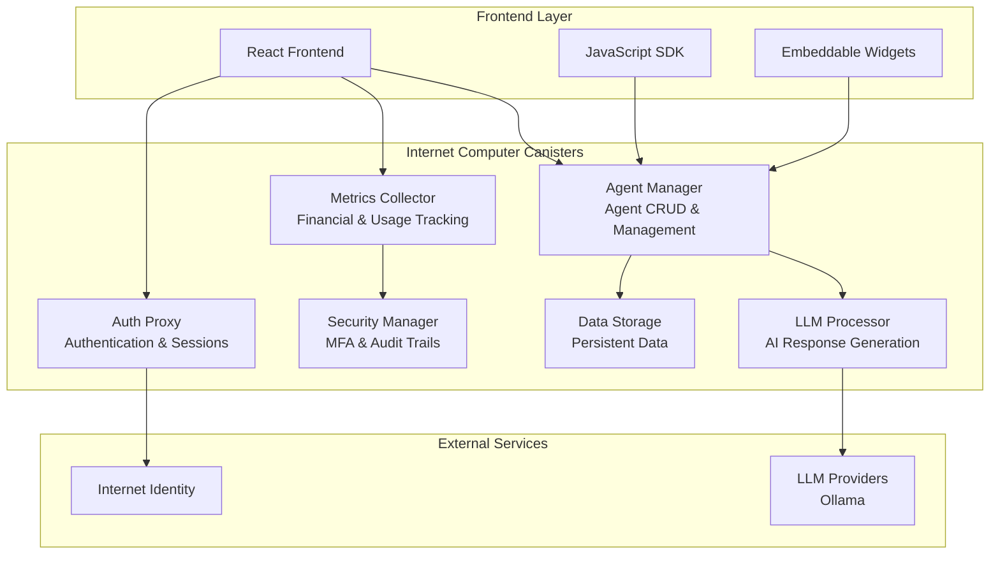

# NeoChat

<div align="center">


**Decentralized AI Agent Platform powered by Internet Computer**

[](https://opensource.org/licenses/MIT)
[](https://internetcomputer.org/)
[](https://www.typescriptlang.org/)
[](https://reactjs.org/)
[](https://internetcomputer.org/docs/current/motoko/intro/)

[Live Demo](https://neochat.io) • [Documentation](./docs/) • [SDK](./sdk/) • [API Reference](./docs/Technical-Testing-Guide.md)

</div>

## 🚀 Overview

NeoChat is a comprehensive decentralized AI agent platform built on the Internet Computer blockchain. It enables users to create, deploy, and interact with AI agents while providing a complete financial system for usage tracking, billing, and enterprise-grade features.

### ✨ Key Features

- **🤖 AI Agent Creation & Management** - Create custom AI agents with specialized capabilities
- **💬 Real-time Chat Interface** - Seamless chat experience with AI agents
- **🔐 Decentralized Authentication** - Secure authentication via Internet Identity
- **💰 Comprehensive Financial System** - Usage tracking, billing, and tier management
- **🎨 Embeddable Widgets** - Drop-in chat widgets for any website
- **📊 Analytics & Insights** - Detailed usage analytics and performance metrics
- **🛡️ Enterprise Security** - Multi-factor authentication and audit trails
- **🔧 Developer SDK** - Comprehensive SDK for custom integrations

## 🏗️ Architecture

NeoChat uses a multi-canister architecture on the Internet Computer for scalability, security, and modularity:



## 🚦 Quick Start

### Prerequisites

- [Node.js](https://nodejs.org/) (v18+)
- [DFX](https://internetcomputer.org/docs/current/developer-docs/setup/install) (v0.15+)
- [Mops](https://mops.one/) (for Motoko packages)
- [Ollama](https://ollama.com/) (for LLM Framework)
### Local Development

1. **Clone the repository**
   ```bash
   git clone https://github.com/alhadad-xyz/neochat.git
   cd neochat
   ```

2. **Install dependencies**
   ```bash
   npm install
   cd src/canistchat_frontend && npm install
   ```

3. **Start local Internet Computer replica**
   ```bash
   dfx start --clean --background
   ```

4. **Pull Internet Identity Canister & LLM Canister**
   ```bash
   dfx deps pull
   dfx deps init internet_identity
   dfx deps init llm --argument '(opt variant { ollama }, null)'
   ```

5. **Deploy canisters locally**
   ```bash
   dfx deploy
   dfx deps deploy
   ```

7. **Open in browser**
   ```
   http://localhost:3000
   ```

### Quick Deployment

```bash
# Deploy to Internet Computer mainnet
dfx deploy --network ic

# Deploy frontend only
dfx deploy --network ic canistchat_frontend
```

## 🔧 Development

### Project Structure

```
neochat/
├── src/
│   ├── canistchat_backend/        # Motoko canisters
│   │   ├── agent_manager/         # Agent CRUD operations
│   │   ├── llm_processor/         # AI processing
│   │   ├── metrics_collector/     # Financial system
│   │   ├── auth_proxy/           # Authentication
│   │   ├── data_storage/         # Data persistence
│   │   └── security_manager/     # Security & MFA
│   ├── canistchat_frontend/      # React frontend
│   └── declarations/             # Generated TypeScript types
├── sdk/                          # JavaScript SDK
├── docs/                         # Documentation
├── memory-bank/                  # Project documentation
└── tests/                        # Test suites
```

### Available Scripts

```bash
# Development
npm start                 # Start all services
npm run dev              # Development mode with hot reload
npm run build            # Build for production
npm test                 # Run test suite

# Canister Management
dfx deploy               # Deploy all canisters
dfx canister status      # Check canister status
dfx generate            # Generate TypeScript declarations

# Frontend Development
cd src/canistchat_frontend
npm start               # Start React development server
npm run build          # Build React application
npm run lint           # Run ESLint
npm run type-check     # TypeScript type checking
```

## 💰 Financial System

NeoChat includes a comprehensive financial system with four tiers:

| Tier | Monthly Cost | Messages | Features |
|------|-------------|----------|----------|
| **Free** | $0 | 100 | Basic agent creation, chat |
| **Base** | $9.99 | 1,000 | Advanced customization, analytics |
| **Pro** | $29.99 | 5,000 | Priority support, custom domains |
| **Enterprise** | Custom | Unlimited | White-label, dedicated support |

### Usage Tracking
- Real-time token usage monitoring
- Automatic billing and overage protection
- Comprehensive analytics and reporting
- Payment method management

## 🔐 Security Features

- **Internet Identity Integration** - Passwordless authentication
- **Multi-Factor Authentication** - 3-tier security system
- **Session Management** - Secure session lifecycle with rotation
- **Audit Trails** - Immutable security event logging
- **Anomaly Detection** - Real-time threat detection
- **Data Encryption** - End-to-end encryption for sensitive data

## 🎨 SDK & Integration

### JavaScript SDK

```bash
npm install @neochat/sdk
```

```javascript
import { CanistChatSDK } from '@neochat/sdk';

const sdk = new CanistChatSDK({
  network: 'ic',
  agentManagerCanisterId: 'your-canister-id'
});

await sdk.initialize();
const response = await sdk.chat('agent-id', 'Hello!');
```

### Embeddable Widget

```html
<div id="neochat-widget"></div>
<script>
(function() {
  // Widget integration code
  const widget = new CanistChatWidget({
    agentId: 'your-agent-id',
    containerId: 'neochat-widget',
    theme: 'light'
  });
})();
</script>
```

### React Integration

```jsx
import { useCanistChat } from '@neochat/sdk';

function ChatComponent() {
  const { sdk, isConnected } = useCanistChat({
    agentManagerCanisterId: 'canister-id'
  });
  
  // Chat implementation
}
```

## 📊 Analytics & Monitoring

- **Real-time Usage Metrics** - Token consumption, response times
- **Financial Analytics** - Revenue tracking, user tier distribution
- **Performance Monitoring** - Canister health, API response times
- **Security Analytics** - Authentication events, threat detection
- **User Behavior** - Chat patterns, agent usage statistics

## 🧪 Testing

### Automated Testing

```bash
# Run all tests
npm test

# Run specific test suites
npm run test:unit          # Unit tests
npm run test:integration   # Integration tests
npm run test:e2e          # End-to-end tests

# QA Testing
./scripts/qa-testing-script.sh local   # Local testing
./scripts/qa-testing-script.sh ic      # IC mainnet testing
```

## 🚀 Deployment

### Internet Computer Mainnet

1. **Configure environment**
   ```bash
   export DFX_NETWORK=ic
   ```

2. **Deploy canisters**
   ```bash
   dfx deploy --network ic
   ```

3. **Configure frontend**
   ```bash
   cd src/canistchat_frontend
   npm run build
   dfx deploy --network ic canistchat_frontend
   ```

### Environment Configuration

Create `.env` files for different environments:

```bash
# .env.local
VITE_NETWORK=local
VITE_AGENT_MANAGER_CANISTER_ID=local-canister-id

# .env.production
VITE_NETWORK=ic
VITE_AGENT_MANAGER_CANISTER_ID=production-canister-id
```

## 🤝 Contributing

- **JUAN SEBASTIAN CITRO** - (Frontend Developer) - https://github.com/mA4rK0
- **I PUTU RIO KURNIAWAN** - (Frontend Developer) - https://github.com/Riokurniawan-id
- **MOHAMMAD KHALID I ALHADAD** - (Backend Developer) - https://github.com/alhadad-xyz

### Development Process

1. Fork the repository
2. Create a feature branch (`git checkout -b feature/amazing-feature`)
3. Commit your changes (`git commit -m 'Add amazing feature'`)
4. Push to the branch (`git push origin feature/amazing-feature`)
5. Open a Pull Request

### Coding Standards

- **TypeScript** for type safety
- **ESLint + Prettier** for code formatting
- **Comprehensive testing** for all features
- **Documentation** for all public APIs

## 📄 License

This project is licensed under the MIT License - see the [LICENSE](LICENSE) file for details.

## 🙏 Acknowledgments

- **Internet Computer** - Decentralized computing platform
- **DFINITY Foundation** - Blockchain infrastructure
- **React Team** - Frontend framework
- **TypeScript Team** - Type-safe JavaScript
- **Motoko Team** - Smart contract language

## 📞 Support

- **Documentation**: [docs/](./docs/)
- **Issues**: [GitHub Issues](https://github.com/alhadad-xyz/neochat/issues)
- **Discussions**: [GitHub Discussions](https://github.com/alhadad-xyz/neochat/discussions)
- **Email**: support@neochat.io

---

<div align="center">

**Built with ❤️ on Internet Computer**

[Website](https://neochat.io) • [Twitter](https://twitter.com/neochat) • [Discord](https://discord.gg/neochat)

</div> 